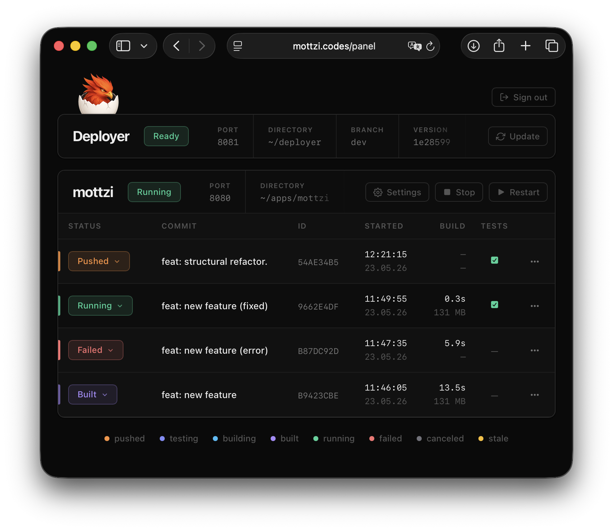

<div align="center">


# Deployer

**Push a commit and watch it deploy automatically.**
<br><br>
[Watch it](https://mottzi.codes/deployer_demo_original.mp4) in action!
<br><br>
</div>

Deployer is a lightweight and self-hosted CI/CD tool to manage your Swift server apps. Every commit you push to your app's repository shows up in a live panel in your browser. Deployer can be triggered automatically or manually, streaming build output and status updates to your browser in real time. You can start or stop your app, trigger tests, set environment variables and rollback to past versions right from the panel! Deployer can be installed with a single command and is powered by [Vapor](https://github.com/vapor/vapor) and [Mist](https://github.com/mottzi/Vapor-Mist).

<br>

<p align="center">
  
</p>

Deployer is designed to be beginner friendly so anyone can take their first steps in the Swift-on-Server ecosystem without the hastle of complicated terminal sessions.

What happens on a push:

1. GitHub fires a webhook to your server.
2. Deployer verifies the signature, then queues the commit.
3. The pipeline checks out the exact SHA, optionally runs tests, and builds.
4. The new binary is swapped in, with the previous one archived as backup.
5. The app restarts.

If something goes wrong, the old binary keeps serving.

## Setup

Before you start, you will need:

- An Ubuntu server with root access.
- A domain pointing at it.
- A Swift app in a GitHub repository.

SSH in and run:

```bash
bash <(curl -sSL https://mottzi.codes/deployer/setup.sh)
```

Setup is interactive. Press enter through the prompts to take the defaults, or override what you want.

Behind the scenes, it:

- installs Swift via Swiftly,
- sets up Nginx with TLS via Let's Encrypt,
- creates a non-root service user and an SSH GitHub deploy key,
- registers a GitHub webhook for push detection,
- hardens SSH and installs `deployerctl` for CLI control.

When setup finishes, your app is live and the panel is listening for the next push.

## What it does

- **Manual or automatic deployments.**

  Pick the mode that suits the project. **Manual** mode records pushed commits and waits for you to trigger deployment by pressing the `Build` or `Build & Run` buttons. **Automatic** mode deploys every pushed commit the moment it lands.

- **Live build output in the panel.**

  Every step of the deployment pipeline (`git fetch`, `git checkout`, `swift test`, `swift build`, and binary swap) streams their output into the panel in real time. If the build fails, the full transcript stays attached to the deployment so you can read it back later.

- **Start and stop from the browser.**

  The target app's service has buttons next to it on the panel.

- **One-click rollback to a previous build.**

  Successful builds can be configured to be archived so you can roll back without rebuilding. Click `Run` on any archived deployment and the service swaps to that binary. By default the five most recent builds are kept, and the retention policy (`target.binaryBehaviour`) is configurable: keep a fixed count, cap by total disk size, keep everything, or keep nothing.

- **Run `swift test` on demand.**

  Tests can run automatically before every build, or only when you press the `Test` button on a deployment. Result output is live streamed into the panel.

- **Edit the app's environment variables in the panel.**

  Open the settings page, edit your app's `.env`, hit save. The file is validated and written atomically. Hit restart and the change is live.

- **deployerctl for terminal based control.**

  A small wrapper script for the things that belong in a terminal: starting and stopping the deployer and your app, tailing logs, rerunning setup, changing configuration and updating the deployer.

## Under the hood

A few details that matter if you care about how it works.

- **Serialized build queue.**

  A `Queue` actor makes sure only one build runs at a time. While a build is in flight, new pushes are recorded as `canceled`. When the build finishes, the queue jumps to the newest canceled push and skips everything in between, so you always end on the latest commit and never queue up stale work.

- **Atomic binary swap with auto-rollback.**

  Before the new binary moves in, the live one is set aside as `.old`. If the move fails for any reason, the previous binary is restored before the error bubbles up.

- **Boot-drain replay.**

  If the server reboots or the deployer crashes mid-deploy, the next start picks up the most recent stranded push and resumes from there.

- **Signed webhooks only.**

  Every incoming webhook is verified with HMAC-SHA256 against the secret generated at setup. Unsigned or malformed payloads are rejected before they reach the queue.

- **Websocket-driven panel.**

  Real-time updates run on [Mist](https://github.com/mottzi/Mist), which pushes database changes to connected clients. No polling, no page reloads. Status badges, row transitions, and live build streams all share the same channel.

- **Stack.**

  Built on [Vapor](https://github.com/vapor/vapor) with [Fluent](https://github.com/vapor/fluent) on SQLite, served through [Leaf](https://github.com/vapor/leaf) templates.

## deployerctl

After setup, `deployerctl` is on the server's `PATH`. Most actions need `sudo`.

```bash
sudo deployerctl <command> [deployer|app|all]
```

```bash
sudo deployerctl status              # show service status for deployer + app
sudo deployerctl restart app         # restart just the target app
sudo deployerctl logs deployer       # follow deployer logs (Ctrl-C to exit)
sudo deployerctl update              # update deployer to the latest release
```

| Action |  |
| --- | --- |
| `status` | Service status (deployer, app, or both) |
| `start` / `stop` / `restart` | Service lifecycle |
| `logs` | Tail the on-disk log file (Ctrl-C to exit) |
| `journal` | Recent systemd journal entries (systemd only) |
| `update` | Update the deployer, with auto-rollback on failure |
| `config` | View or change a field in `deployer.json` |
| `setup` | Rerun setup interactively |
| `remove` | Tear down the install |
| `version` | Print the deployer version |
| `help` | Print usage |

Targets are `deployer`, `app`, or `all` (default).

## Configuration

With the default service user `vapor` and an app named `MyApp`, the install looks like:

```
/home/vapor/
├── deployer/
│   ├── deployer            # the deployer binary
│   ├── deployer.json       # this config file
│   ├── deployer.db         # SQLite database
│   └── deployer.log        # service log
└── apps/
    └── MyApp/              # your app's git checkout
        ├── .env            # target app environment variables
        └── deploy/
            ├── MyApp       # running app binary
            ├── MyApp.log   # app log
            └── binaries/   # archived past builds (rollback targets)
```

Runtime settings live in `deployer.json`, beside the deployer binary:

```json
{
    "port": 8081,
    "panelRoute": "/deployer",
    "socketPath": "/deployer/ws",
    "serviceManager": "systemd",
    "dbFile": "deployer.db",
    "deployerDirectory": ".",
    "deployerBranch": "main",
    "buildFromSource": false,
    "target": {
        "name": "MyApp",
        "directory": "../apps/MyApp",
        "branch": "main",
        "appPort": 8080,
        "buildMode": "release",
        "deploymentMode": "manual",
        "testing": true,
        "pusheventPath": "/pushevent/MyApp",
        "binaryBehaviour": {
            "newest": {
                "count": 5
            }
        }
    }
}
```

Most fields are wired into the live system at setup time (Nginx, systemd unit, clone path, webhook secret). Editing them by hand will drift the config from the install.

Six fields are safe to change at runtime and have a CLI for it:

```bash
sudo deployerctl config target.deploymentMode automatic
sudo deployerctl config target.testing true
```

The runtime-editable set: `deployerBranch`, `target.branch`, `target.buildMode`, `target.deploymentMode`, `target.binaryBehaviour`, `target.testing`. Each edit is validated against the same checks the deployer runs at boot, and you're offered a restart so the change goes live right away.

For anything else, just rerun setup:

```bash
sudo deployerctl setup
```

Setup remembers your previous answers and offers them as defaults. Changing one value is a matter of pressing enter through the rest. You can use the setup command to recover corrupted installations.

## Limitations

- **One target per install.** A deployer manages one app. If you have two apps, run a second deployer for the other one.
- **One branch per target.** Pushes on other branches are ignored. No PR previews or per-branch environments today.

The smaller surface is most of the point. If your needs fit inside it, the whole system is something you can read and understand in an afternoon.
